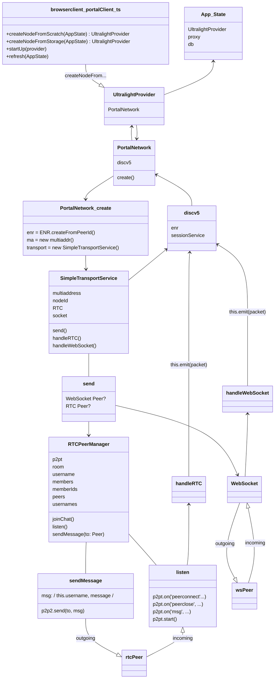

```mermaid
classDiagram
    direction TB
    class App_State{
        UltralightProvider
        proxy
        db
    }
    class browserclient_portalClient_ts{
        +createNodeFromScratch(AppState) UltralightProvider
        +createNodeFromStorage(AppState) UltralightProvider
        +startUp(provider)
        +refresh(AppState)
    }
    class UltralightProvider {
        PortalNetwork
    }
    class PortalNetwork_create {
        enr = ENR.createFromPeerId()
        ma = new multiaddr()
        transport = new SimpleTransportService()
    }
    class discv5{
      enr
      sessionService
    }

    class SimpleTransportService {
        multiaddress
        nodeId
        RTC
        socket
        send()
        handleRTC()
        handleWebSocket()
    }
    class RTCPeerManager {
        p2pt
        room
        username
        members
        memberIds
        peers
        usernames
        joinChat()
        listen()
        sendMessage(to: Peer)
    }
    class sendMessage {
        msg: / this.username, message /
        p2p2.send(to, msg)
    }
    class send {
        WebSocket Peer?
        RTC Peer?
    }
    class PortalNetwork {
        discv5
        create()
    }
    browserclient_portalClient_ts --|> UltralightProvider: createNodeFrom...
    App_State <-- UltralightProvider

    UltralightProvider <-- PortalNetwork
    UltralightProvider --> PortalNetwork

    PortalNetwork --> PortalNetwork_create
    PortalNetwork <-- discv5
    
    PortalNetwork_create --> SimpleTransportService
    discv5 <-- SimpleTransportService


    SimpleTransportService -- send
    send --> RTCPeerManager
    send --> WebSocket
    handleWebSocket <-- WebSocket
    RTCPeerManager -- sendMessage


    RTCPeerManager -- listen
    listen: p2pt.on('peerconnect'...)
    listen: p2pt.on('peerclose', ...)
    listen: p2pt.on('msg', ...)
    listen: p2pt.start()
    discv5 <-- handleWebSocket : this.emit(packet)
    discv5 <-- handleRTC : this.emit(packet)
    sendMessage --|> rtcPeer : outgoing
    listen <|-- rtcPeer : incoming
    handleRTC <-- listen
    WebSocket --|> wsPeer : outgoing
    WebSocket <|-- wsPeer : incoming
    
```