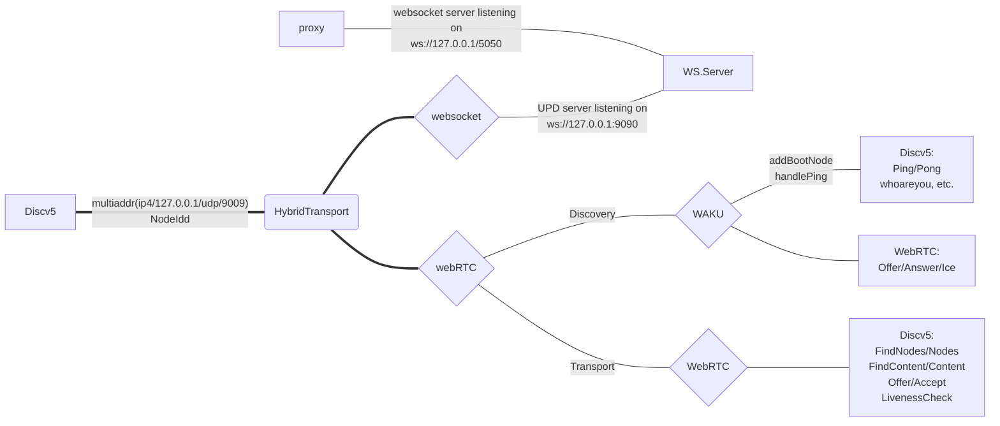
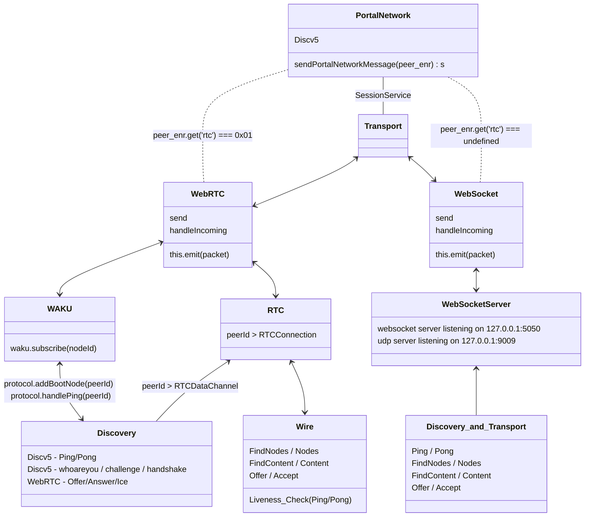
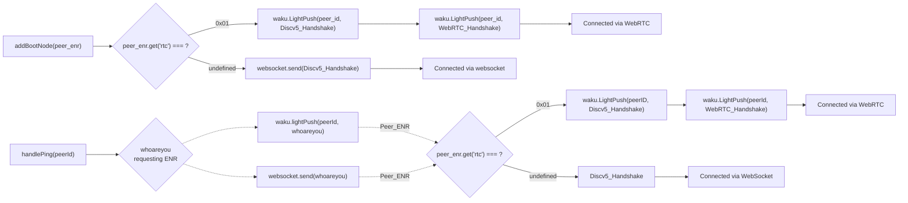
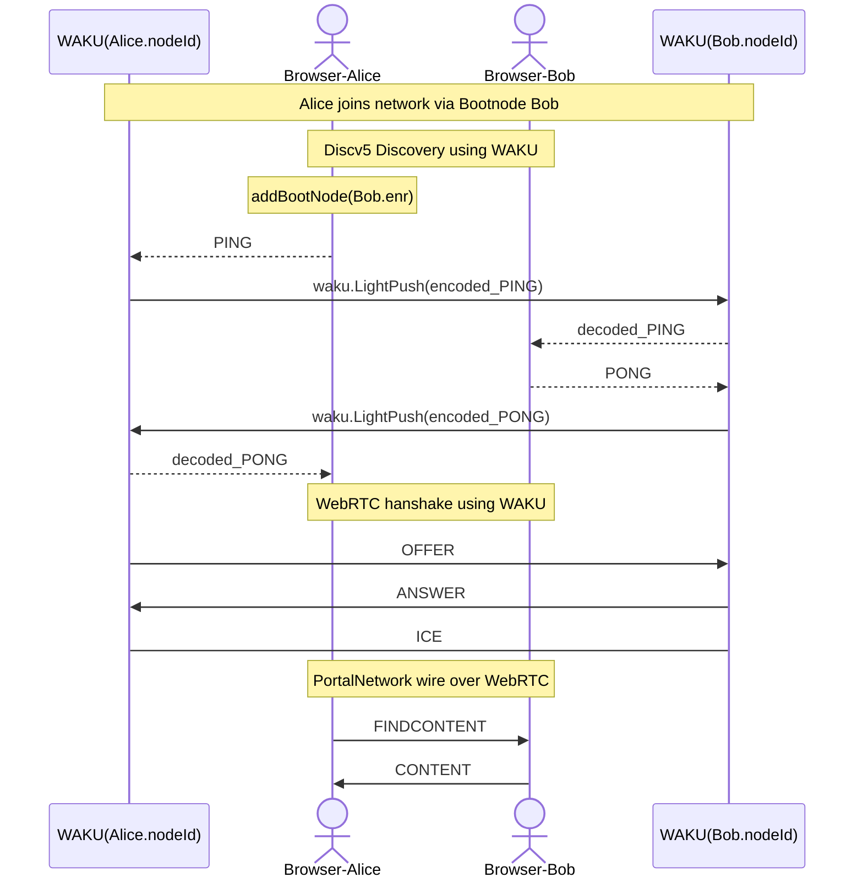

```mermaid
graph LR
    X[proxy] ---- |websocket server listening on<br/>ws://127.0.0.1/5050| O[WS.Server]
B(HybridTransport)
    A[Discv5] === |"multiaddr(ip4/127.0.0.1/udp/9009)"<br/>NodeIdd| B
    B === W{websocket}
    W --- |UPD server listening on<br/>ws://127.0.0.1:9090|O
    B === C{webRTC}
    C ---|Discovery| D{WAKU}
    D --- |addBootNode<br/>handlePing|P[Discv5:<br/>Ping/Pong<br/>whoareyou, etc.]
    C ---|Transport| F{WebRTC}
    F --- T[Discv5:<br/>FindNodes/Nodes<br/>FindContent/Content<br/>Offer/Accept<br/>LivenessCheck]
    D --- R[WebRTC:<br/>Offer/Answer/Ice]
```

```mermaid
classDiagram
    class PortalNetwork {
        sendPortalNetworkMessage(peer_enr)s
        Discv5
    }
    PortalNetwork .. WebRTC : peer_enr.get('rtc') === 0x01
    Transport <--> WebRTC
    Transport <--> WebSocket
    PortalNetwork .. WebSocket  : peer_enr.get('rtc') === undefined
    PortalNetwork -- Transport : SessionService
    WebRTC : send
    WebRTC : handleIncoming
    WebRTC : this.emit(packet)
    WebRTC <--> WAKU
    WAKU : waku.subscribe(nodeId)
    WAKU <--> Discovery : protocol.addBootNode(peerId) <br/> protocol.handlePing(peerId)
    Discovery : Discv5 - Ping/Pong
    Discovery : Discv5 - whoareyou / challenge / handshake
    Discovery : WebRTC - Offer/Answer/Ice
    RTC <-- Discovery : peerId > RTCDataChannel
    WebRTC <--> RTC
    RTC <--> Wire
    Wire : Liveness_Check(Ping/Pong)
    Wire : FindNodes / Nodes
    Wire : FindContent / Content
    Wire : Offer / Accept
    RTC : peerId > RTCConnection
    WebSocket : send
    WebSocket : handleIncoming
    WebSocket : this.emit(packet)
    WebSocket <--> WebSocketServer
    class WebSocketServer {
        websocket server listening on 127.0.0.1:5050
        udp server listening on 127.0.0.1:9009
    }
    WebSocketServer <-- Discovery_and_Transport
    Discovery_and_Transport : Ping / Pong
    Discovery_and_Transport : FindNodes / Nodes
    Discovery_and_Transport : FindContent / Content
    Discovery_and_Transport : Offer / Accept

```

```mermaid
graph LR
    A["addBootNode(peer_enr)"] --> Z{"peer_enr.get('rtc') === ?"}
    Z -->|0x01| D["waku.LightPush(peer_id, Discv5_Handshake)"]
    Z -->|undefined| E["websocket.send(Discv5_Handshake)"]
    D --> N["waku.LightPush(peer_id, WebRTC_Handshake)"]
    N --> O[Connected via WebRTC]
    E --> M[Connected via websocket]
    B["handlePing(peerId)"] --> C{"whoareyou<br/>requesting ENR"}
    C -.-> H["waku.lightPush(peerId, whoareyou)"]    
    C -.-> G["websocket.send(whoareyou)"]    
    H -.-> |Peer_ENR| I
    G -.-> |Peer_ENR| I{"peer_enr.get('rtc') === ?"}
    I --> |0x01| J["waku.LightPush(peerID, Discv5_Handshake)"]
    I --> |undefined| K[Discv5_Handshake]
    J --> L["waku.LightPush(peerId, WebRTC_Handshake)"]
    L --> P[Connected via WebRTC]
    K --> Q[Connected via WebSocket]

```

```mermaid
sequenceDiagram
    participant wa as WAKU(Alice.nodeId)
    actor a as Browser-Alice
    actor b as Browser-Bob
    participant wb as WAKU(Bob.nodeId)
    Note over wa,wb: Alice joins network via Bootnode Bob
    Note over a,b: Discv5 Discovery using WAKU
    Note over a: addBootNode(Bob.enr)
    a-->>wa: PING
    wa->>wb: waku.LightPush(encoded_PING)
    wb-->>b: decoded_PING
    b-->>wb: PONG
    wb->>wa: waku.LightPush(encoded_PONG)
    wa-->>a: decoded_PONG
    Note over a,b: WebRTC hanshake using WAKU
    wa->>wb: OFFER
    wb->>wa: ANSWER
    wa->wb: ICE
    Note over a,b: PortalNetwork wire over WebRTC
    a->>b: FINDCONTENT
    b->>a: CONTENT
```
