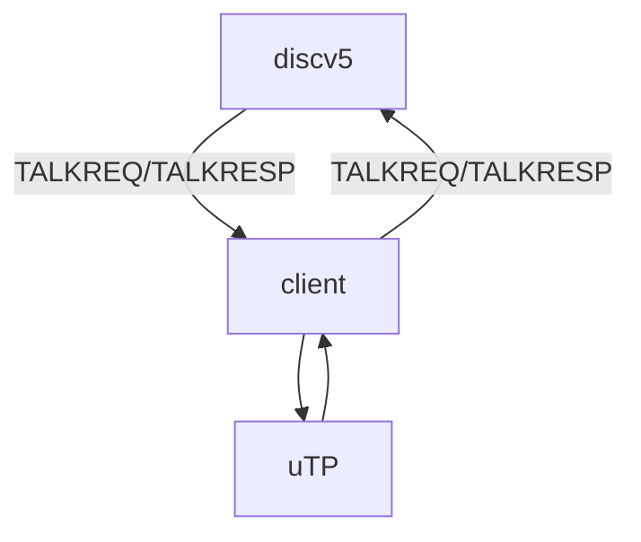
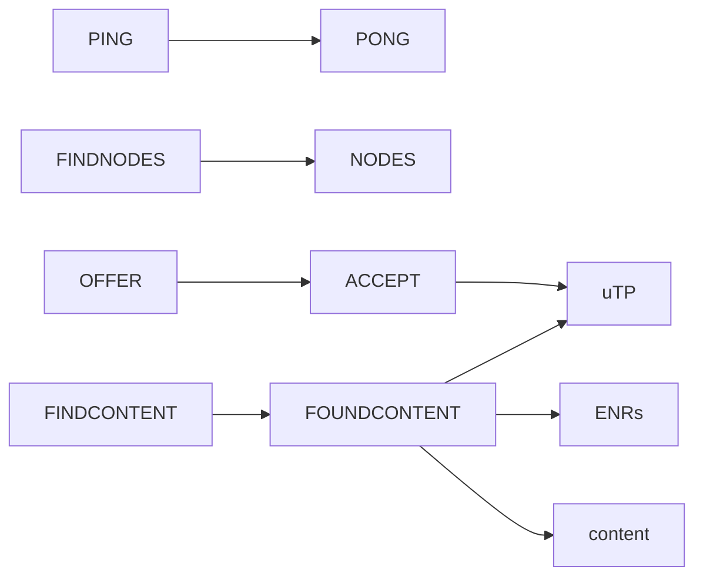
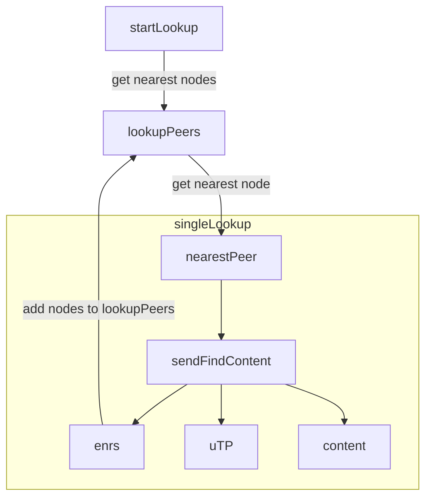
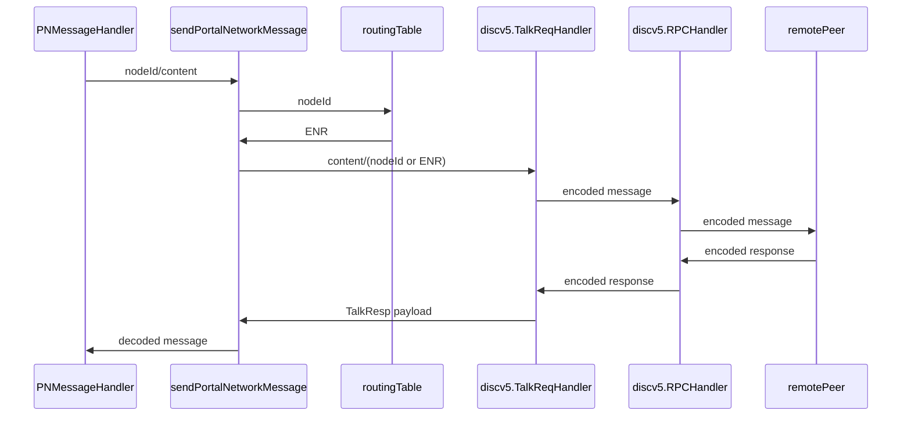

# Portalnetwork Module Architecture

The `portalnetwork` module is broken down into several components that all work together to produce a usable Portal Network client.

## Main Dependency Flow

## Portal Network message flows

## Content Lookup

## Portal Network Message Lifecycle
