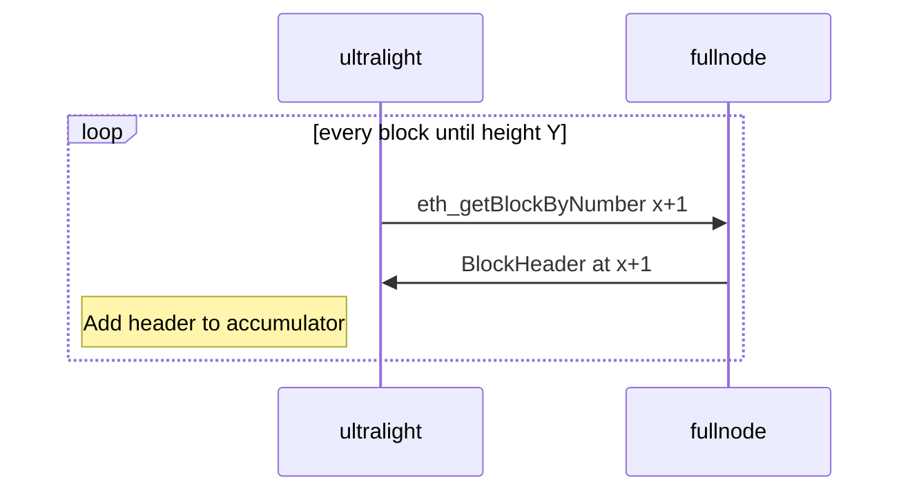

# Header Accumulator Update Strategy -- *UNDER CONSTRUCTION*

The `Header Accumulator` is used to verify that block headers received from other nodes are part of the canonical chain following [the spec](https://github.com/ethereum/portal-network-specs/blob/header-gossip-test-vectors/header-gossip-network.md).

## Header Accumulator Construction

When we're first starting up, we should begin building the accumulator from genesis using the below sequence, starting at height x = 1 until we reach some preferred height Y (maybe at least height 8193 -- start of Epoch 2)

