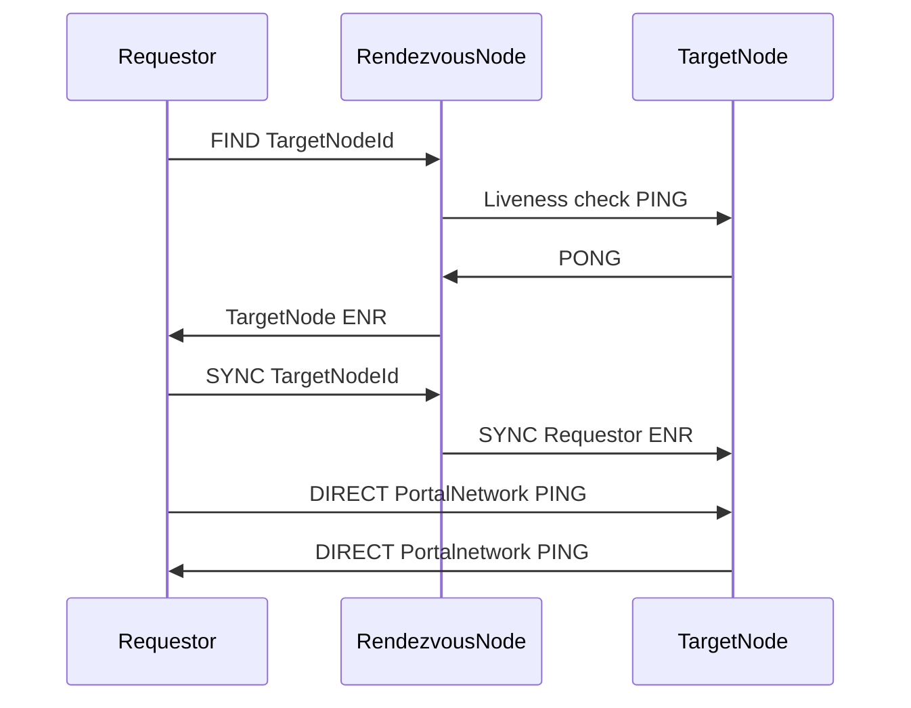

## Rendezvous Flow

```mermaid
    sequenceDiagram
        Requestor->>RendezvousNode: FIND TargetNodeId
        RendezvousNode->>TargetNode: Liveness check PING
        TargetNode->>RendezvousNode: PONG
        RendezvousNode->>Requestor: TargetNode ENR
        Requestor->>RendezvousNode: SYNC TargetNodeId
        RendezvousNode->>TargetNode: SYNC Requestor ENR
        Requestor->>TargetNode: DIRECT PortalNetwork PING
        TargetNode->>Requestor: DIRECT Portalnetwork PING
```