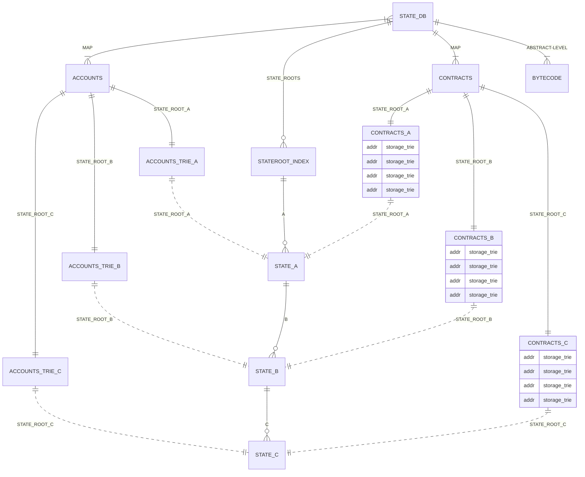
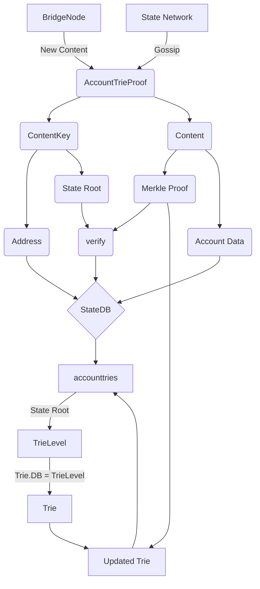
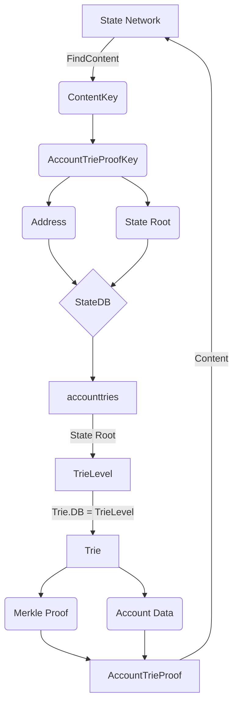

# State Network Database

### DB Structure

```mermaid
erDiagram
    STATE_DB }|--|{ ACCOUNTS : MAP    
    STATE_DB ||--o{ STATEROOT_INDEX : STATE_ROOTS
    STATE_DB ||--|{ CONTRACTS : MAP
    STATE_DB ||--|{ BYTECODE : ABSTRACT-LEVEL
    
    ACCOUNTS ||--|| ACCOUNTS_TRIE_C: STATE_ROOT_C
    ACCOUNTS ||--|| ACCOUNTS_TRIE_B: STATE_ROOT_B
    ACCOUNTS ||--|| ACCOUNTS_TRIE_A: STATE_ROOT_A
    CONTRACTS ||--|| CONTRACTS_A: STATE_ROOT_A
    CONTRACTS ||--|| CONTRACTS_B: STATE_ROOT_B
    CONTRACTS ||--|| CONTRACTS_C: STATE_ROOT_C
    
    STATEROOT_INDEX ||--o{ STATE_A : A
    ACCOUNTS_TRIE_A ||..|| STATE_A: STATE_ROOT_A
    ACCOUNTS_TRIE_B ||..|| STATE_B: STATE_ROOT_B
    ACCOUNTS_TRIE_C ||..|| STATE_C: STATE_ROOT_C
    CONTRACTS_C ||..|| STATE_C: STATE_ROOT_C
    CONTRACTS_A ||..|| STATE_A: STATE_ROOT_A
    CONTRACTS_B ||..|| STATE_B: STATE_ROOT_B
    STATE_A ||--o{ STATE_B : B
    STATE_B ||--o{ STATE_C : C
    CONTRACTS_A {
        addr storage_trie
        addr storage_trie
        addr storage_trie
        addr storage_trie
    }
    CONTRACTS_B {
        addr storage_trie
        addr storage_trie
        addr storage_trie
        addr storage_trie
    }
    CONTRACTS_C {
        addr storage_trie
        addr storage_trie
        addr storage_trie
        addr storage_trie
    }


```

### Store: AccountTrieProof

```mermaid
flowchart TD
    Bridge[BridgeNode]
    Network[State Network]
    StateDB{StateDB}
    ACC(Account Data)
    PROOF(Merkle Proof)
    VALID(verify)
    ATP(AccountTrieProof)
    Bridge -->|New Content| ATP
    Network -->|Gossip| ATP
    ATP --> KEY(ContentKey)
    ATP --> CON(Content)
    KEY --> ADD(Address)
    KEY --> ROOT(State Root)
    ADD --> StateDB
    ROOT --> VALID
    PROOF --> VALID
    CON --> PROOF
    CON --> ACC
    VALID --> StateDB
    ACC --> StateDB
    StateDB --> Subs[accounttries]
    Subs --> |State Root| Sub[TrieLevel]
    Sub --> |Trie.DB = TrieLevel| Trie[Trie]
    Trie --> FROM[Updated Trie]
    PROOF --> FROM
    FROM --> Subs
```

### Find Content: AccountTrieProof (account + state_root)

```mermaid
flowchart TD
    Network[State Network]
    StateDB{StateDB}
    ACC(Account Data)
    PROOF(Merkle Proof)
    ATPK(AccountTrieProofKey)
    KEY(ContentKey)
    KEY --> ATPK
    Network -->|FindContent| KEY
    ATPK --> ADD(Address)
    ATPK --> ROOT(State Root)
    ADD --> StateDB
    ROOT --> StateDB
    StateDB --> Subs[accounttries]
    Subs --> |State Root| Sub[TrieLevel]
    Sub --> |Trie.DB = TrieLevel| Trie[Trie]
    Trie --> ACC
    Trie --> PROOF
    PROOF --> ATP[AccountTrieProof]
    ACC --> ATP
    ATP --> |Content|Network

```
