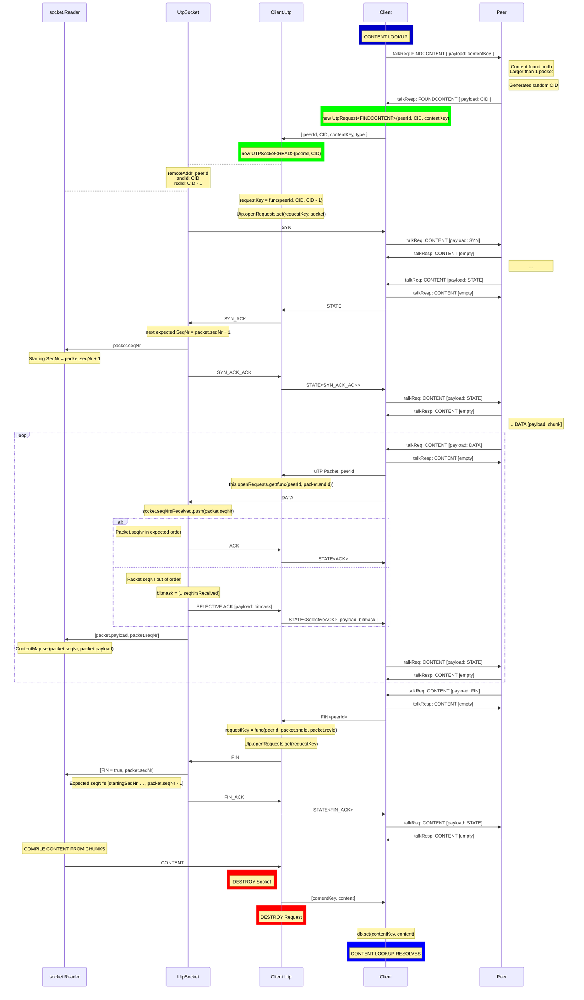

# FINDCONTENT

Client sends a *talkReq: **FINDCONTENT** [payload: `contentKey`]* as part of a CONTENT LOOKUP

Peers responds with *talkResp: **FOUNDCONTENT** [payload: `uTP_Connection_Id` ]*

Client initiates a uTP connection

When all data has been transfered, the socket and request are both closed.

CONTENT LOOKUP resolves after adding new content to database.

